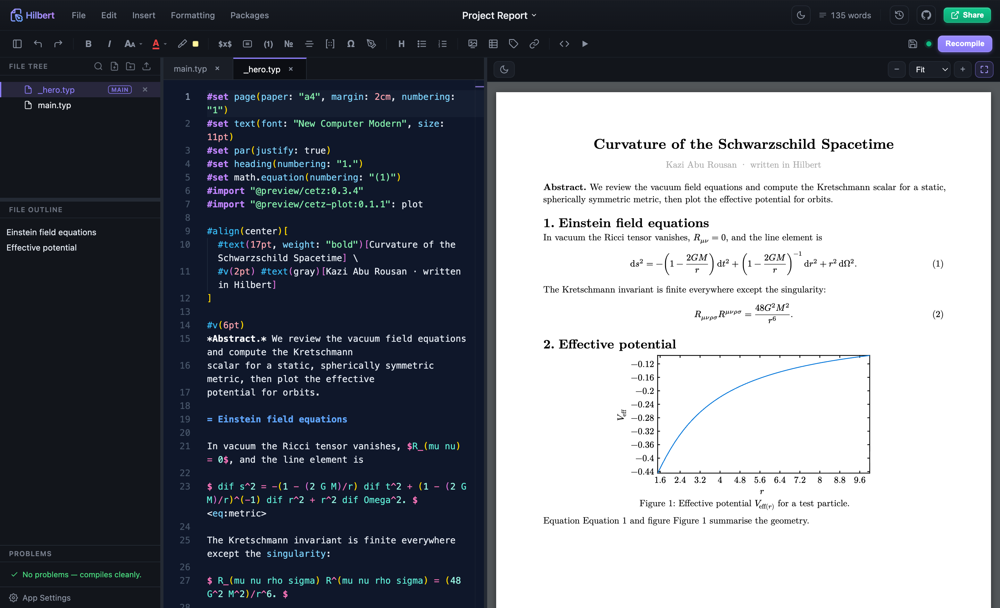
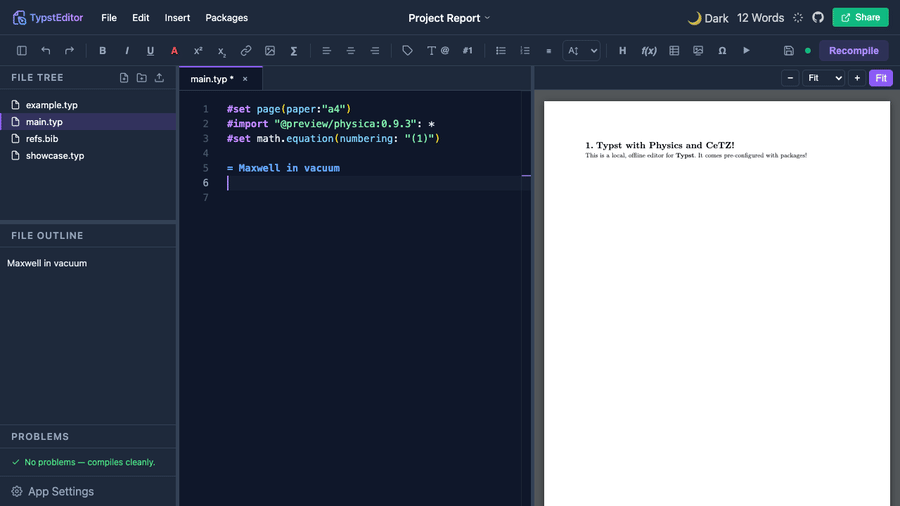
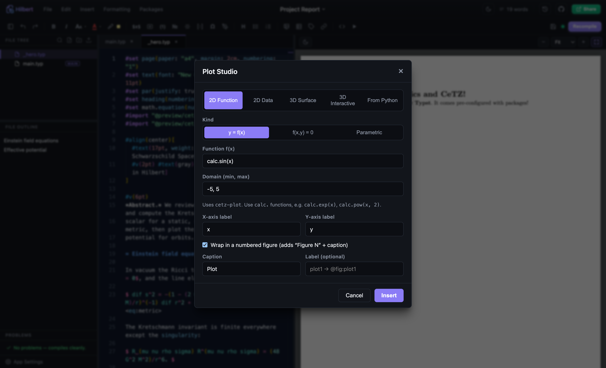
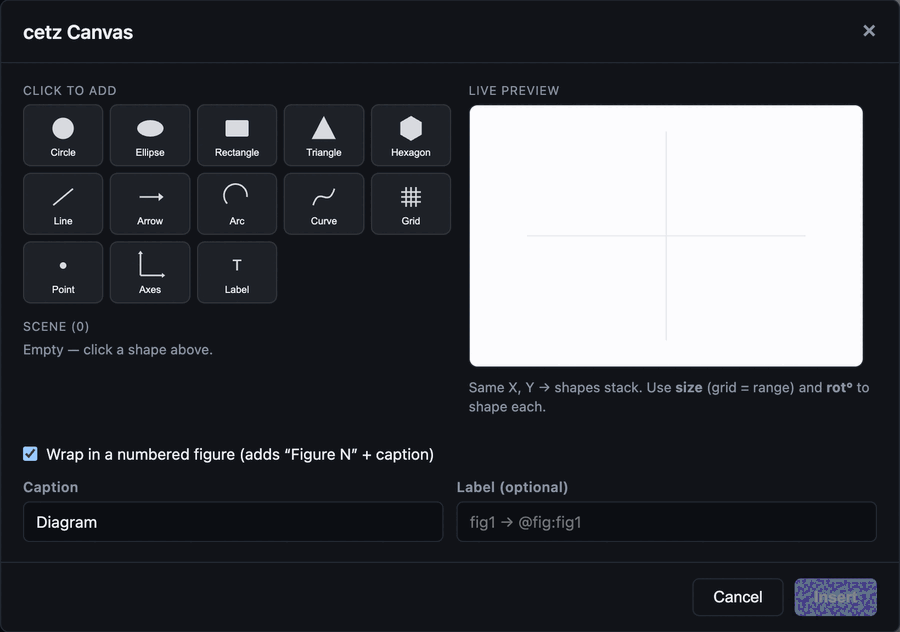
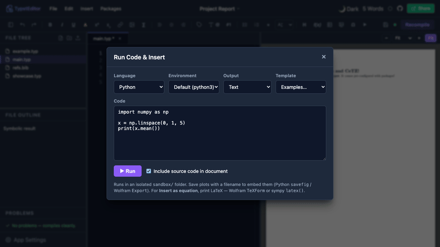
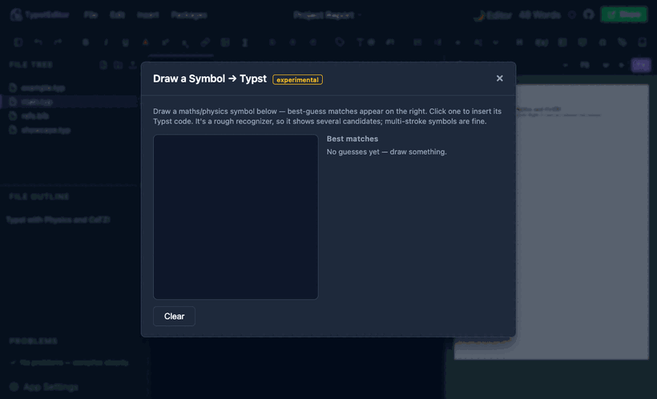
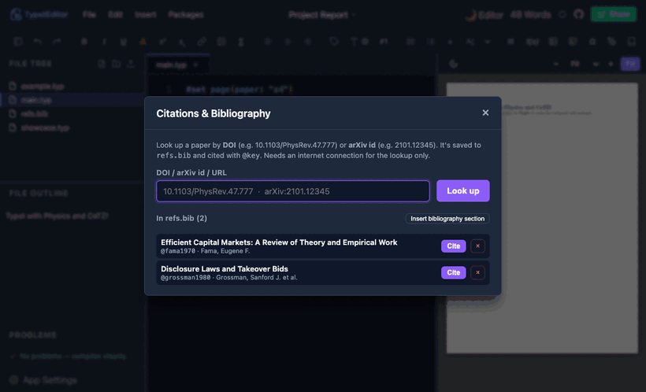
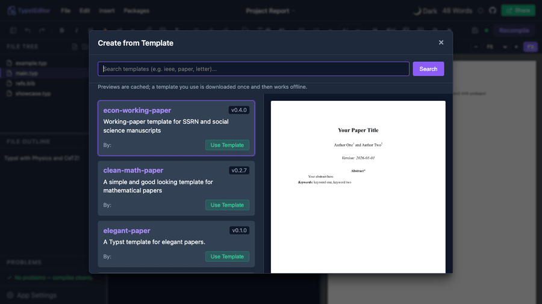
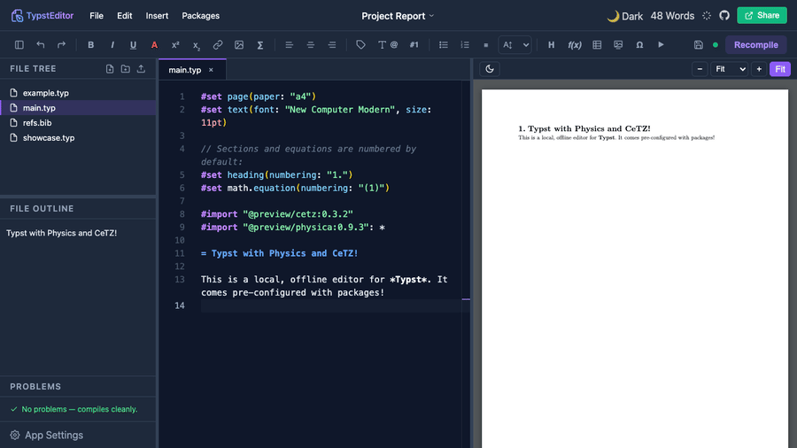

# Hilbert: an unofficial scientific-writing IDE for Typst

> **Unofficial.** Hilbert is an independent, community-built application. It is not
> the Typst web app, IDE, or compiler, and is not affiliated with or endorsed by
> the Typst team. "Typst" is a trademark of its respective owners; this project
> merely builds on top of the open-source Typst compiler.

> **Website:** [rousan.netlify.app/hilbert](https://rousan.netlify.app/hilbert/). The
> landing page has a feature overview and download links.

> **Automatic updates:** Hilbert updates itself. Install it once and every future
> version arrives on its own (it asks before installing). Grab it from the
> [latest release](https://github.com/aburousan/hilbert-editor/releases/latest).
> On Linux the AppImage auto-updates; the `.deb` does not.

It started as "an offline, Overleaf-feeling place to write physics and maths," and
grew into a full scientific-writing IDE: a real code editor on the left, a live PDF
on the right, and everything in between. Equations, matrices, plots, diagrams,
theorems, citations, and running code are one click away instead of something you
memorise. It runs entirely on your machine, works offline, and can execute your
Python, Julia, or Wolfram snippets and drop the result straight into the document.



---

## Contents

- [Why you'll like it](#why-youll-like-it)
- [Feature tour (with demos)](#feature-tour)
- [Everything in the box](#everything-in-the-box): the full list
- [What you need](#what-you-need)
- [Get it (downloads & install)](#get-it)
- [Run from source](#run-from-source)
- [Tips](#a-few-tips) · [Troubleshooting](#troubleshooting) · [Configuration](#configuration) · [Security](#security-model)
- [What's next](#whats-next)

---

## Why you'll like it

The PDF re-renders as you type, and the editor is Monaco, the same one VS Code runs
on, with real Typst hover-docs and autocomplete. The whole thing is up and usable in
well under a second.

Most of the things you'd normally have to memorise are a click away instead:
equations, matrices, tables, figures, theorem boxes, citations by DOI or arXiv, 2D
and 3D plots, commutative and Feynman diagrams. Each drops in as clean, editable
Typst that stays yours. And it'll do the actual maths: run a Python, Julia, or
Wolfram snippet and get the result back as a typeset equation, or highlight an
expression and simplify, solve, or integrate it where it sits.

Underneath it behaves like a real workspace. Open any folder the way you would in VS
Code, split a document across `#include`d chapters, drag files around the tree,
search the whole project at once.

It's also genuinely light: the Tauri build idles around 12 MB of memory and installs
in under 9 MB, a fraction of what a typical Electron editor costs
([benchmarks](docs/PERFORMANCE.md)). It works offline, updates itself, and keeps
crashes contained (a broken tool shows an error instead of blanking the editor). On
Windows it never flashes a console window at you.

---

## Feature tour

A live PDF preview recompiles as you type, with zoom, fit-to-width, and a dark mode.
Double-click any word in the PDF to jump to it in the source.



Plot Studio is one tool for every plot: 2D functions (`y=f(x)`, implicit,
parametric), 2D data (line, scatter, bar), and 3D surfaces, plus a one-click launch
into the interactive 3D studio and the Python/matplotlib runner. It emits `cetz` and
`cetz-plot`.



cetz Canvas lets you draw diagrams visually. Click shapes from a palette onto a live
preview, then set each one's position, size, rotation, and colour. No blind
coordinates.



Commutative diagrams are drawn in a bundled, offline copy of
[quiver](https://github.com/varkor/quiver), which produces editable `fletcher` code.


Run Python, Julia, or Wolfram and insert the result as text, a figure, or a typeset
equation.



Colour anything with a draggable colour-grid picker.


Sketch a symbol and get its Typst code (experimental).



Cite by DOI or arXiv id: Hilbert looks the paper up, saves it to `refs.bib`, and
cites it.



Browse Typst Universe templates with a rendered preview.



Toggle a dark PDF preview, like Overleaf.



### More visual builders

Feynman diagrams support fermion, photon, gluon, scalar, and ghost propagators,
loops, hatched or shaded blobs, vertices, and labels, all producing editable `cetz`.


Matrix Studio is a visual grid with fills, borders, brackets, and a code-array mode.


3D Plot Studio lets you rotate a surface to the exact angle you want, then insert
that view.


Flowchart to Code: draw the logic, and it writes the `while`, `if`, and `for`.


> Everything happens on your computer. A tiny local server drives the Typst compiler
> and (optional) code execution. Nothing leaves the machine unless you deliberately
> turn on Google Drive or WebDAV sync.

---

## Everything in the box

The full list, grouped by what you're doing.

### Editing & preview
- **Monaco editor** with Typst highlighting, plus hover documentation and smart
  autocomplete powered by [tinymist](https://github.com/Myriad-Dreamin/tinymist):
  hover any function for its signature and docs, and get completions for every
  builtin, package export, and label. There's also `@`-reference autocomplete and
  image-path autocomplete inside `image("…")`.
- **Live PDF preview** that recompiles as you type, with zoom, fit-to-width, a dark
  PDF mode, and double-click-to-source (it uses the surrounding words to land on the
  right occurrence).
- **Multi-file projects.** The preview compiles the project root (`main.typ` or the
  `typst.toml` entrypoint), so `#include`d chapters that share a bibliography or
  labels render as a whole. The root shows a MAIN badge; right-click any `.typ` and
  choose **Set as main file** to change it.
- A clickable **Problems** panel, a **File Outline**, resizable panes, and a live
  word count of the rendered document (read from the PDF, so `#set`/`#import`/markup
  don't inflate it).
- Control-flow completions that offer both `{ }` code and `[ ]` content bodies for
  `if`, `for`, and `while`.

### Project & file management (VS Code-style)
- **Open Folder** makes any folder on disk the workspace (edits save straight back on
  the desktop app and in Chrome/Edge), with **File → Open Recent**.
- **File tree**: multi-select, drag-and-drop move, rename, duplicate, delete, cut,
  copy, paste, a right-click context menu, new file and folder (styled in-app
  dialogs), image/asset upload, compress to `.zip`, and reveal-in-file-manager.
- **Full-text search** across the workspace with jump-to-line.

### Inserting the annoying stuff
- Title blocks, headings, abstracts, authors, institutes.
- Inline, block, aligned, and numbered equations (numbering on by default; toggle it
  under the cursor with **⌘⇧N**).
- **Matrices** (visual Matrix Studio), tables, figures, images, and lists, most with
  a *center on page* toggle.
- **Page Setup builder** (Formatting → Page Setup): paper size, per-side margins,
  header/footer, and page numbers, which writes the `#set page(...)` rule.
- **Text formatting**: bold, italic, super- and subscript, a draggable colour picker,
  underline, highlight, strike-through, boxed selections (fill, border, texture),
  font-size dropdown, alignment, rotation, and small caps.
- **Cross-references**: add a label (`= Intro <sec:intro>`), type `@`, and pick it.
- **Image editor**: crop and rotate raster images (PNG/JPG) before inserting; SVGs
  open as a safe preview.

### Maths & physics
- A **maths and physics symbol picker** (`physica`), and, experimentally, a
  draw-a-symbol pad.
- **Theorems, proofs, and lemmas**, plain or in coloured boxes, each kind numbered.
- A **Physics & Cosmology menu** of ready-made, compile-checked equations: bra-kets,
  commutators, the Dirac and Klein-Gordon equations, the QED Lagrangian, Einstein's
  field equations, Christoffel symbols, the FRW metric, the Friedmann equations, and
  more.
- An **equation gallery** of fill-in templates.

### Plots & diagrams
- **Plot Studio**, the unified plotting tool: 2D functions (explicit, implicit,
  parametric), 2D data (line, scatter, bar), 3D `cetz` surfaces, plus launchers for
  the interactive 3D studio and the Python/matplotlib runner.
- **cetz Canvas**, a visual shape builder: 13 primitives (circle, ellipse, rectangle,
  triangle, hexagon, line, arrow, arc, curve, grid, point, axes, label) with a live
  preview and per-shape position, size (grid range / radius / length), rotation, and
  colour.
- **3D Plot Studio**, an interactive surface you rotate, then insert exactly that
  view.
- **Commutative diagrams** via bundled offline [quiver](https://github.com/varkor/quiver),
  producing editable `fletcher`.
- **Feynman diagrams** drawn visually, producing editable `cetz`.
- **Flowchart to Code**: draw logic, get `while`, `if`, and `for`.
- 2D plotting via `cetz` and `cetz-plot`.

### Maths that computes
- **Run code, insert result** (Python, Julia, Wolfram): take the text output, a
  generated figure, or, in *equation mode*, write plain maths like
  `diff(sin(x**2), x)` and get a typeset equation back automatically.
- **Compute on a selection**: highlight an expression and simplify, solve,
  differentiate, integrate, or evaluate it with sympy, dropped back in as an equation.
- **Ready-made physics examples** in the runner: General Relativity with
  [xAct](http://www.xact.es/) (Schwarzschild curvature to the Ricci tensor and the
  Kretschmann scalar), Penrose (conformal) diagrams, and Clebsch-Gordan and Wigner
  3-j coefficients, as a rendered image or a typeset equation.

### References & bibliography
- A **reference and label manager** listing every label and `@reference`, flagging
  undefined, duplicate, or unused ones.
- A **citation manager**: look a paper up by DOI or arXiv id, save it to `refs.bib`,
  and cite it with `@key` (the bibliography section is added for you).

### Getting things in and out
- Import data (CSV, JSON, YAML, TOML) with the matching Typst reader wired up.
- **Import your own fonts** (`.ttf` / `.otf`) via File → Import Font.
- **Templates** from Typst Universe with a rendered preview.
- **Git**: init, commit, push to GitHub.
- **Export** to PDF, HTML, `.typ`, a local folder, Google Drive, or WebDAV
  (Nextcloud / ownCloud).
- **Manage installed Typst packages**: search, download, remove.

### Reliability & platform
- **Auto-updater** (Tauri build): checks on launch, asks before installing, and is
  best-effort. If the check can't run, the app still starts normally.
- **Crash isolation**: heavy tools (3D studio, Plot Studio, whiteboard, code runner)
  are sandboxed, so an error shows a dismissible message instead of blanking the
  editor.
- A failed compile keeps your last good preview; on Windows, background tools never
  flash a console window; the backend survives a misbehaving tool.
- **Offline**: bundled Typst packages are cached locally, so documents compile with
  no network and no downloads.

---

## What you need

Hilbert drives external tools rather than reimplementing them, so a couple of things
must be on your `PATH`:

- **[Typst CLI](https://github.com/typst/typst) 0.14 or newer**, required for
  compiling. Install it with `brew install typst`, `winget install Typst.Typst`,
  `cargo install typst-cli`, or a release binary. Verify with `typst --version`.
- Optional but recommended: **[tinymist](https://github.com/Myriad-Dreamin/tinymist)**,
  the Typst language server, for hover docs and smart autocomplete.
  - **macOS:** `brew install tinymist`
  - **Windows:** `winget install Myriad-Dreamin.tinymist` (or `scoop install tinymist`)
  - **Linux, or any OS with Rust:** `cargo install tinymist`
  Without it the editor still works fully; those two features just stay quiet.
- Optional, only for running code:
  - **Python 3** with `numpy`, `matplotlib`, `sympy`
  - **Julia** (`Latexify` for equation mode)
  - **WolframScript**
- **Node.js 18+**, only if you run from source.

---

## Get it

The **[landing page](https://rousan.netlify.app/hilbert/)** has an overview and
download links. Prebuilt installers are on the
[**Releases**](https://github.com/aburousan/hilbert-editor/releases) page. The app is
tiny (~9 MB), light on memory, and it auto-updates.

| Platform | Download |
| --- | --- |
| **Windows** | `.exe` / `.msi` |
| **macOS, Apple Silicon** | `…-macOS-arm64.dmg` |
| **macOS, Intel** | `…-macOS-x64.dmg` |
| **Linux** | `.AppImage` (auto-updates) / `.deb` |

On a Mac, pick Apple Silicon for M-series chips and Intel for older Macs (*About This
Mac* tells you which). The desktop app still needs the **Typst CLI** on your `PATH`.

> **macOS, first launch.** The app isn't notarised (there's no paid Apple developer
> account), so macOS quarantines it, and renaming or moving the `.app` can break its
> ad-hoc signature. If it won't open or says it's *"damaged"*, run these two commands
> once:
> ```bash
> xattr -cr "/Applications/Hilbert.app"
> codesign --force --deep --sign - "/Applications/Hilbert.app"
> ```
> **Run these as two separate commands, one per line.** If you paste them joined onto
> a single line, the shell reads `--force` as an option to `xattr` and reports it as
> unrecognised. Enter the first line, press return, then the second. (Adjust the path
> if the app is elsewhere, e.g. `~/Downloads`.) The code is open, so you can audit or
> build it yourself. This is a one-time step.

### Windows
Download the `.exe` (or `.msi`) from Releases and run it. It behaves like a normal
Windows app: launching tools never flashes a console window, and a failed compile
shows an error panel instead of closing. You still need the **Typst CLI** on `PATH`.

---

## Run from source

```bash
git clone https://github.com/aburousan/hilbert-editor.git
cd hilbert-editor
bash scripts/setup.sh   # installs Typst + Python deps and runs npm install (macOS/Linux)
npm run dev             # Vite UI on http://localhost:5173, backend on http://127.0.0.1:3001
```
`npm run dev` serves the UI with Vite and starts the Rust backend (the Tauri binary
in headless mode) on port 3001, so it needs the sibling `../typst-editor-tauri`
checkout and a Rust toolchain. To build the desktop app, run `cargo tauri build` in
`../typst-editor-tauri`.

On Windows, run from source with:
```powershell
winget install Typst.Typst
git clone https://github.com/aburousan/hilbert-editor.git
cd hilbert-editor ; npm install ; npm run dev   # then open http://localhost:5173
```

---

## A few tips

- **Compile**: edits recompile after a short pause; **⌘S** saves and recompiles now.
- **Numbering**: put the cursor on a heading or block equation and press **⌘⇧N**.
- **Cross-references**: add a label (`= Intro <sec:intro>`), then type `@` and pick it.
- **Cite a paper**: Insert → References → Citations, look it up by DOI/arXiv, hit **Cite**.
- **Plots**: Insert → Plots → **Plot Studio** for everything, or **cetz Canvas** for
  free-form diagrams.
- **Compute**: select an expression, Insert → Math → Compute Selection.

---

## Troubleshooting

- **macOS says the app is "damaged" or won't open.** This is Gatekeeper quarantine, or
  a broken signature from renaming the `.app`. Fix it with the two commands in
  [Get it](#get-it), run **one per line, as two separate commands** (pasting them onto
  one line makes the shell treat `--force` as an argument to `xattr`, and it errors):
  ```bash
  xattr -cr "/Applications/Hilbert.app"
  codesign --force --deep --sign - "/Applications/Hilbert.app"
  ```
- **Window is blank, or it says "couldn't start its local engine".** Something else is
  using port 3001. Quit it and reopen.
- **It opens but nothing compiles.** The **Typst CLI** isn't installed or on `PATH`.
  Install it and confirm `typst --version` works.
- **A template fails with an error inside `@preview/…`.** That's a package
  compatibility problem, not the editor: some Typst Universe templates pull in helper
  packages written for an older Typst. Pick a different template, or match the Typst
  version the template expects. Your own document is fine.
- **`npm run dev` only prints the concurrently line and stops.** The dev dependencies
  aren't installed. Run a full `npm install` (not `--production`).

---

## Configuration

| Variable | Default | Purpose |
| --- | --- | --- |
| `ALLOW_CODE_EXECUTION` | `1` | Set to `0` to disable all code execution. |
| `EXEC_TIMEOUT_MS` | `45000` | Per-run wall-clock limit. |

Interpreters (including conda environments) are auto-detected; choose the default per
language in **App Settings → Interpreters**. Your documents live in
`~/Documents/Hilbert`.

---

## Security model

The backend is built for **local, single-user** use:
- Binds to `127.0.0.1` only; CORS limited to `localhost` / `127.0.0.1`.
- File access is confined to the workspace (path traversal rejected).
- Code execution is opt-outable (`ALLOW_CODE_EXECUTION=0`), time-limited, runs in a
  `sandbox/` dir, and is screened for process / network / shell / destructive calls.

These are guardrails, not a hardened sandbox: code runs with your user privileges.
Don't expose port 3001 to a network, and don't run untrusted documents. For untrusted
use you'd want real OS-level isolation (a container or VM).

Cloud credentials (Google Drive OAuth, WebDAV) live only in your browser's local
storage.

---

## What's next

Hilbert already does most of what a scientific-writing IDE should, so the next
releases are about making what's here rock-solid: fixing rough edges, and making it
faster and lighter (tracked in the [benchmarks](docs/PERFORMANCE.md)) rather than
piling on more. If something breaks or feels slow, that's exactly what I want to hear.
Open a [Discussion](https://github.com/aburousan/hilbert-editor/discussions).

## Support

Built and maintained by [Kazi Abu Rousan](https://rousan.netlify.app/). If it saves
you time, you can [buy me a coffee](https://buymeacoffee.com/rousan). It's genuinely
appreciated (there's also a button in the app's **About** dialog).

## License

MIT; see [LICENSE](LICENSE). Bundled third-party software:
[quiver](https://github.com/varkor/quiver) (MIT, © varkor) with
[KaTeX](https://katex.org/) (MIT) under `public/quiver/`.
