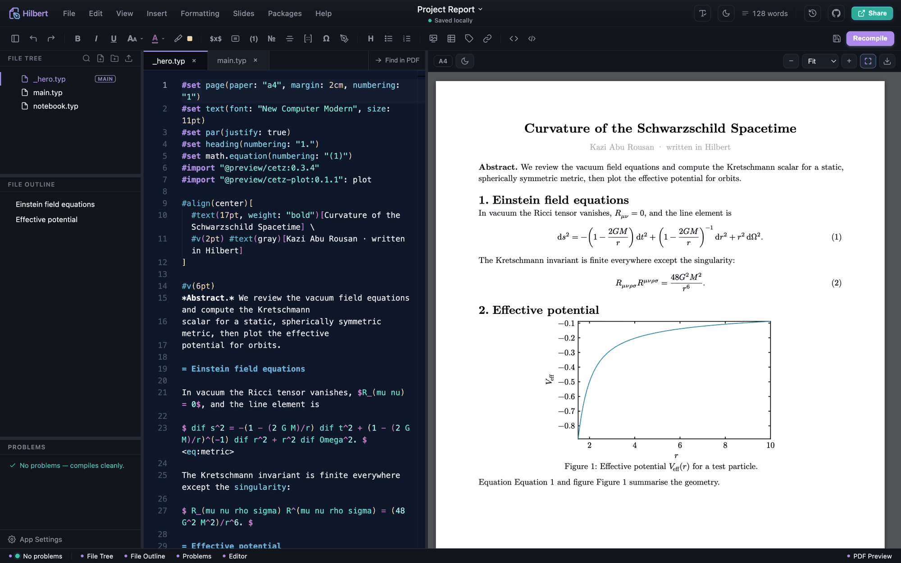
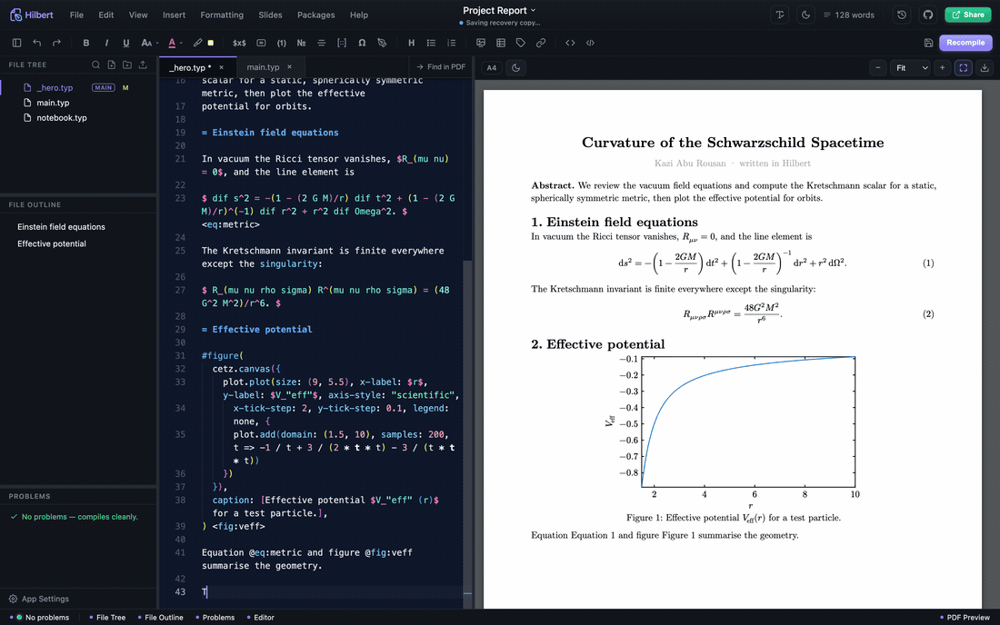
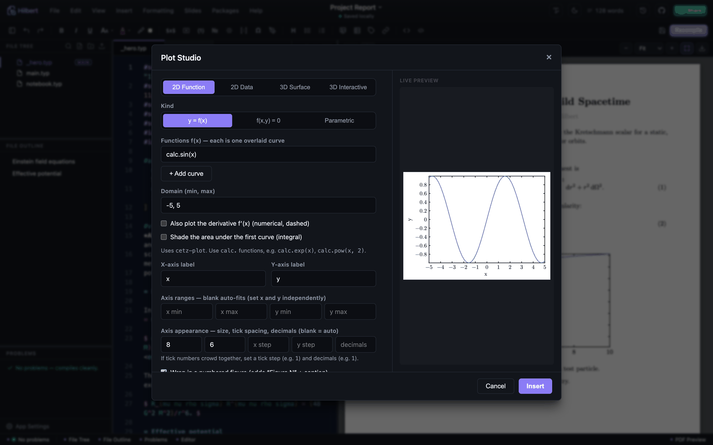
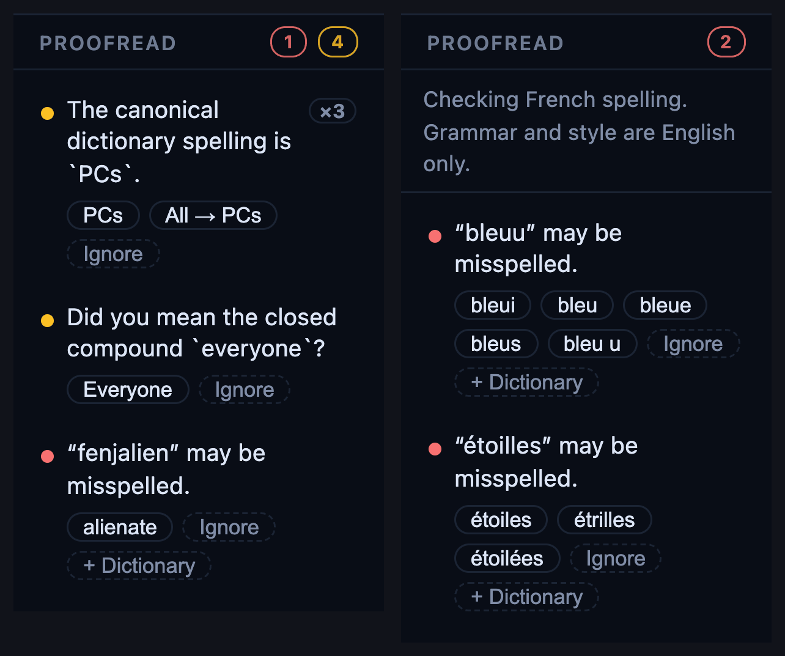
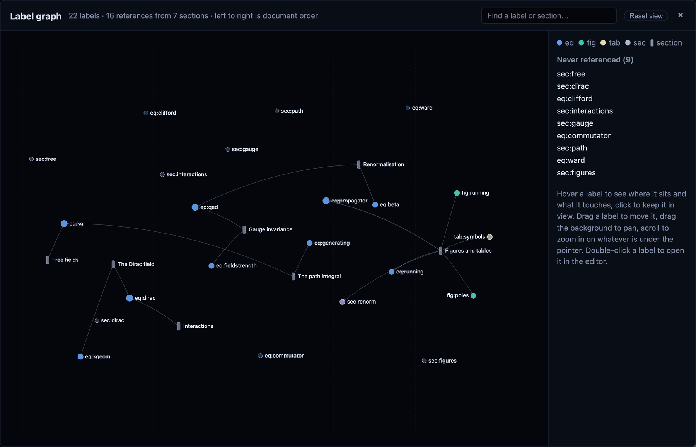

# Hilbert: an unofficial scientific-writing IDE for Typst

> **Unofficial.** Hilbert is an independent, community-built application. It is not
> the Typst web app, IDE, or compiler, and is not affiliated with or endorsed by
> the Typst team. "Typst" is a trademark of its respective owners; this project
> merely builds on top of the open-source Typst compiler.

It started as "an offline, Overleaf-feeling place to write physics and maths," and
grew into a full scientific-writing IDE: a real code editor on the left, a live PDF
on the right. Equations, matrices, plots, diagrams, theorems, citations, and running
code are a click away instead of something you memorise. It runs entirely on your
machine, works offline, and can execute your Python, Julia, or Wolfram snippets and
drop the result straight into the document.




**[Download](https://github.com/aburousan/hilbert-editor/releases/latest)** ·
[Website](https://rousan.netlify.app/hilbert/) ·
[What changed](docs/RELEASE_NOTES.md) ·
[Handbook (PDF)](docs/Hilbert-Handbook.pdf) ·
[Every feature](docs/FEATURES.md) ·
[Collaboration](docs/COLLABORATION.md) ·
[Configuration and security](docs/CONFIGURATION.md)

Hilbert updates itself. Install it once and every future version arrives on its own,
asking before it installs. On Linux the AppImage auto-updates; the `.deb` gets its
updates from the apt repository below.

---

## What it's like to use

The PDF re-renders as you type. The editor is Monaco, the same one VS Code runs on,
with Typst hover-docs and autocomplete. It opens and is usable in well under a second.



Most of the syntax you'd otherwise have to memorise is a click away: equations,
matrices, tables, figures, theorem boxes, citations by DOI or arXiv, 2D and 3D plots,
commutative and Feynman diagrams. Each drops in as clean, editable Typst that stays
yours. Press ⌘K and you can search every one of them by name.


It will also do the actual maths. Run a Python, Julia, or Wolfram snippet and get the
result back as a typeset equation, or highlight an expression and simplify, solve, or
integrate it where it sits. Run Notebook goes further and executes every code block in
the document as one session, so variables carry from cell to cell and the output is
written back under each block.


Plot Studio is one tool for every plot: 2D functions, 2D data, 3D surfaces, plus a
one-click launch into the interactive 3D studio and the Python/matplotlib runner. It
emits `cetz` and `cetz-plot`.



Switch proofreading on and the sidebar gains a Proofread panel: spelling in red,
grammar in amber, style in blue, with the fixes one click away. A complaint that
repeats forty times is one row with a count, and Ignore takes all forty with it.
English is built in; declare any other language with `#set text(lang: "fr")` and
Hilbert fetches that dictionary once, from a list of ninety-eight, after which it
works offline like the rest of the app.



A paper's cross-references are a structure nobody normally gets to see. **View → Label
Graph** draws it: what each section refers to, which equations everything leans on, and
which labels nothing refers to at all.



Underneath it behaves like a real workspace. Open any folder the way you would in VS
Code, split a document across `#include`d chapters, drag files around the tree, search
the whole project at once.

It is also small. The backend idles at 12 MB and installs in 37 MB, a fraction of what
a comparable Electron editor costs, and a thousand-file project only takes it to 18 MB
([benchmarks](docs/PERFORMANCE.md)). It works offline, updates itself, and keeps
crashes contained: a broken tool shows an error rather than blanking the editor. On
Windows it never flashes a console window at you.

> Everything happens on your computer. A small local server drives the Typst compiler
> and (optional) code execution. Nothing leaves the machine unless you deliberately
> turn on Google Drive or WebDAV sync.

**[docs/FEATURES.md](docs/FEATURES.md) is the full list** — visual builders for
matrices, Feynman diagrams, commutative diagrams and flowcharts, slide decks, the
reference and citation managers, templates, every export format, live collaboration
and the hosted browser workspace.

---

## What you need

Hilbert drives external tools rather than reimplementing them, so a couple of things
must be on your `PATH`:

- [Typst CLI](https://github.com/typst/typst) 0.15 or newer, required for compiling.
  Install it with `brew install typst`, `winget install Typst.Typst`,
  `cargo install typst-cli`, or a release binary. Verify with `typst --version`.
- [tinymist](https://github.com/Myriad-Dreamin/tinymist), the Typst language server,
  is optional but recommended, for diagnostics, hover docs, and autocomplete:
  `brew install tinymist`, `winget install --exact --id Myriad-Dreamin.Tinymist`,
  or `cargo install tinymist`. Without it the editor still compiles and previews
  normally; language-server features stay quiet. The path, version and running state
  are shown under **App Settings → General**.
- For running code, optionally: Python 3 (with `numpy`, `matplotlib`, `sympy`), Julia
  (`Latexify` for equation mode), and WolframScript.
- Node.js 18+ and a [Rust toolchain](https://rustup.rs) (stable), only if you run
  from source.

---

## Get it

Prebuilt installers are on the
[Releases](https://github.com/aburousan/hilbert-editor/releases) page.

| Platform | Download |
| --- | --- |
| Windows | `winget install Aburousan.Hilbert`, or `.exe` / `.msi` |
| macOS, Apple Silicon | `…-macOS-arm64.dmg` |
| macOS, Intel | `…-macOS-x64.dmg` |
| Linux | `.AppImage` (auto-updates) / `.deb` / `.rpm` |

On a Mac, pick Apple Silicon for M-series chips and Intel for older Macs (*About This
Mac* tells you which).

> **macOS, first launch.** The app isn't notarised (there's no paid Apple developer
> account), so macOS quarantines it, and renaming or moving the `.app` can break its
> ad-hoc signature. If it won't open, or says it's *"damaged"*, run these two commands
> once:
> ```bash
> xattr -cr "/Applications/Hilbert.app"
> codesign --force --deep --sign - "/Applications/Hilbert.app"
> ```
> **Run these as two separate commands, one per line.** If you paste them joined onto
> a single line, the shell reads `--force` as an option to `xattr` and reports it as
> unrecognised. (Adjust the path if the app is elsewhere.) This is a one-time step.

**macOS, Homebrew.** `brew install --cask aburousan/hilbert/hilbert`, then
`brew upgrade --cask hilbert` later. Gatekeeper may still refuse the first launch;
either add `--no-quarantine` to the install, or follow the note above.

**Windows, winget.** Hilbert is in the Microsoft package repository, so you can
install it and everything it needs without visiting a download page:

```powershell
winget install --exact --id Aburousan.Hilbert
winget install --exact --id Typst.Typst
winget install --exact --id Myriad-Dreamin.Tinymist
```

That installs per user and asks for no administrator rights. `winget upgrade
Aburousan.Hilbert` picks up a new release if the app hasn't already updated itself.
Or download the `.exe` (or `.msi`) from Releases and run it — same application.

Hilbert also looks where the Windows package managers actually put things — winget's
`Links` and `Packages` folders, scoop's shims, chocolatey's `bin` — so a Typst or
tinymist installed after the app was last started is still found.

**Linux (Debian / Ubuntu).** Install from the apt repository so `apt upgrade` keeps it
current:

```bash
curl -fsSL https://aburousan.github.io/hilbert-apt/hilbert-archive-keyring.asc \
  | sudo gpg --dearmor -o /usr/share/keyrings/hilbert-archive-keyring.gpg
echo "deb [arch=amd64 signed-by=/usr/share/keyrings/hilbert-archive-keyring.gpg] https://aburousan.github.io/hilbert-apt stable main" \
  | sudo tee /etc/apt/sources.list.d/hilbert.list
sudo apt update && sudo apt install hilbert
```

---

## Run from source

Everything lives in this one repository: the React/Monaco frontend at the root and
the Rust backend under `src-tauri/`. You need Node.js 18+ and a stable
[Rust toolchain](https://rustup.rs); the first run compiles the backend.

```bash
git clone https://github.com/aburousan/hilbert-editor.git
cd hilbert-editor
bash scripts/setup.sh   # installs Typst + Python deps and runs npm install (macOS/Linux)
npm run dev             # Vite UI on http://localhost:5173, backend on http://127.0.0.1:3001
```

`npm run dev` serves the UI with Vite (hot reload) and starts the Rust backend in
headless mode on port 3001. For the real desktop app, `npm run desktop` builds the
frontend and opens the native window — that's also what a release build ships. On
Windows: `winget install Typst.Typst`, then `npm install ; npm run dev`.

## Run from Docker

The repository also builds a container that runs Hilbert's hosted mode: the browser
is the editor, the compiler and the project live in the container, and the folder you
mount is the project.

```sh
docker build -t hilbert-editor:latest .
docker run -d --name hilbert-editor \
  -p 127.0.0.1:8080:3001 \
  -e HILBERT_SERVER_TOKEN="a-random-secret-of-at-least-32-characters" \
  -v "$(pwd)/hilbert-workspace:/app/data" \
  hilbert-editor:latest
```

Open [http://localhost:8080](http://localhost:8080/) and sign in with that token.
Leave `HILBERT_SERVER_TOKEN` out and the container prints a fresh one to
`docker logs hilbert-editor` at every start. The mounted folder must be writable by
uid 1000; if yours is not, add `--user "$(id -u):$(id -g)"`. Code cells are confined
by the container and nothing else — bubblewrap cannot work inside an ordinary
container, so the image sets `HILBERT_SANDBOX=off` and relies on the container
boundary; `-e ALLOW_CODE_EXECUTION=0` turns code cells off entirely. Before putting
the port on a network, read the hosted-workspace section of
[docs/COLLABORATION.md](docs/COLLABORATION.md).

---

## A few tips

- Compile: edits recompile after a short pause; ⌘S saves and recompiles now.
- Find anything: ⌘K opens the command palette; every menu action is in it.
- Numbering: put the cursor on a heading or block equation and press ⌘⇧N.
- Cross-references: add a label (`= Intro <sec:intro>`), then type `@` and pick it.
- Cite a paper: Insert → References → Citations, look it up by DOI or arXiv, hit Cite.
- Plots: Insert → Plots → Plot Studio for everything, or cetz Canvas for free-form
  diagrams.
- Compute: select an expression, then Insert → Math → Compute Selection.
- Run code: the `</>` toolbar button runs every code block in the file as one session.

## Troubleshooting

- **macOS says the app is "damaged" or won't open.** Gatekeeper quarantine, or a
  broken signature from renaming the `.app`. Fix it with the two commands in
  [Get it](#get-it), run one per line.
- **Window is blank, or it says "couldn't start its local engine".** Something else is
  using port 3001. Quit it and reopen.
- **It opens but nothing compiles.** The Typst CLI isn't installed or on `PATH`.
  Confirm `typst --version` works.
- **Tinymist works in a terminal but the app says it isn't installed.** A running
  program keeps the environment it started with, and the desktop hands every app the
  one it captured at login. Send the output of **Help → Copy Diagnostics**, which
  includes the `PATH` it searched.
- **It sits on "Compiling…" and won't finish.** Past a few seconds the status bar says
  *still waiting on Typst*; saving still works meanwhile. Recompile to start over, and
  **Help → Copy Diagnostics** records every line `typst watch` emitted.
- **A template fails with an error inside `@preview/…`.** A package compatibility
  problem, not the editor: some Typst Universe templates pull in helper packages
  written for an older Typst. Your own document is fine.
- **`npm run dev` only prints the concurrently line and stops.** Run a full
  `npm install` (not `--production`).

Before filing a bug, run **Help → Copy Diagnostics**. It puts the activity log on the
clipboard together with the Typst and tinymist it found and the `PATH` it searched,
and the bug report form has a box waiting for it. On Windows especially, a windowed
app has no console to print to, so without that text a report can only describe the
symptom.

---

## What's next

I built Hilbert for my own writing, and at this point it does everything I personally
need. So there's no roadmap of features I'm racing to add. From here it's bug fixes,
whatever users ask for, and the occasional update when something genuinely useful comes
along.

That means the fastest way to change what happens next is to ask. If something is
broken, missing, or annoying, open an
[Issue](https://github.com/aburousan/hilbert-editor/issues) or a
[Discussion](https://github.com/aburousan/hilbert-editor/discussions). Feature requests
from people actually writing papers are what I'll act on first.

## License

MIT; see [LICENSE](LICENSE). Built and maintained by
[Kazi Abu Rousan](https://rousan.netlify.app/). Bundled third-party software:
[quiver](https://github.com/varkor/quiver) (MIT, © varkor) with
[KaTeX](https://katex.org/) (MIT) under `public/quiver/`.
