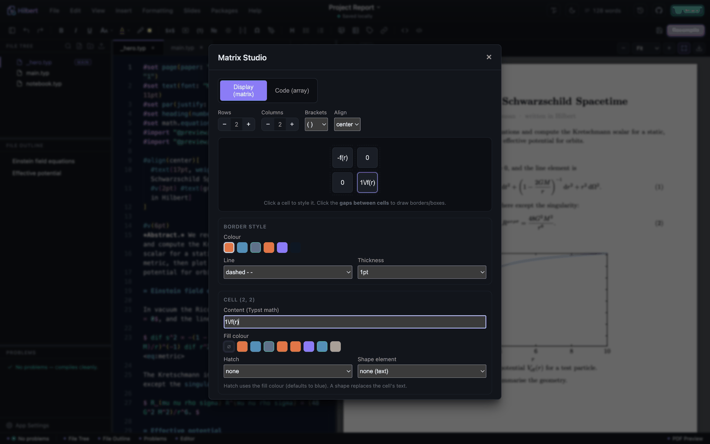
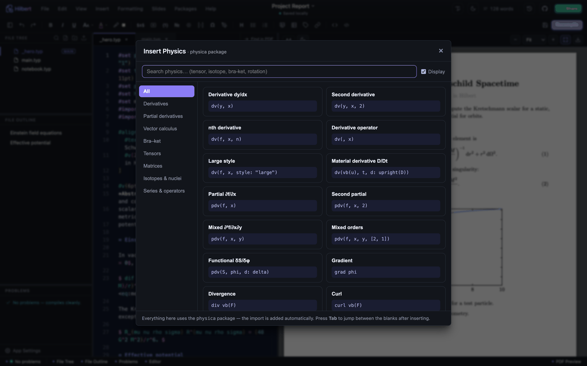
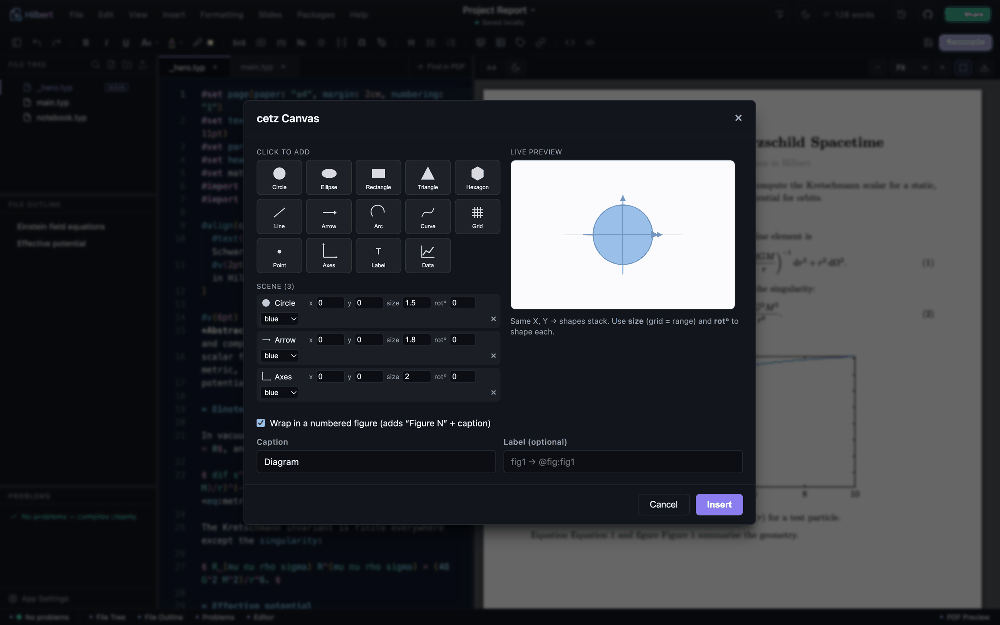
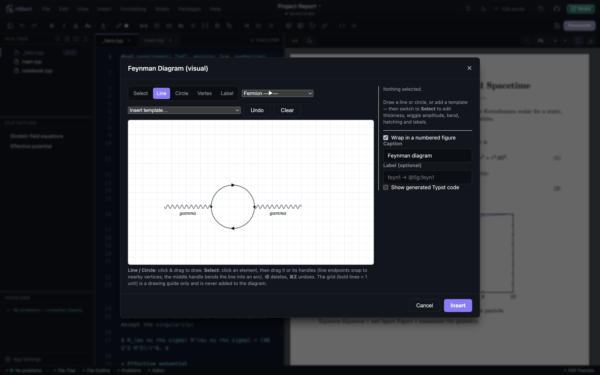
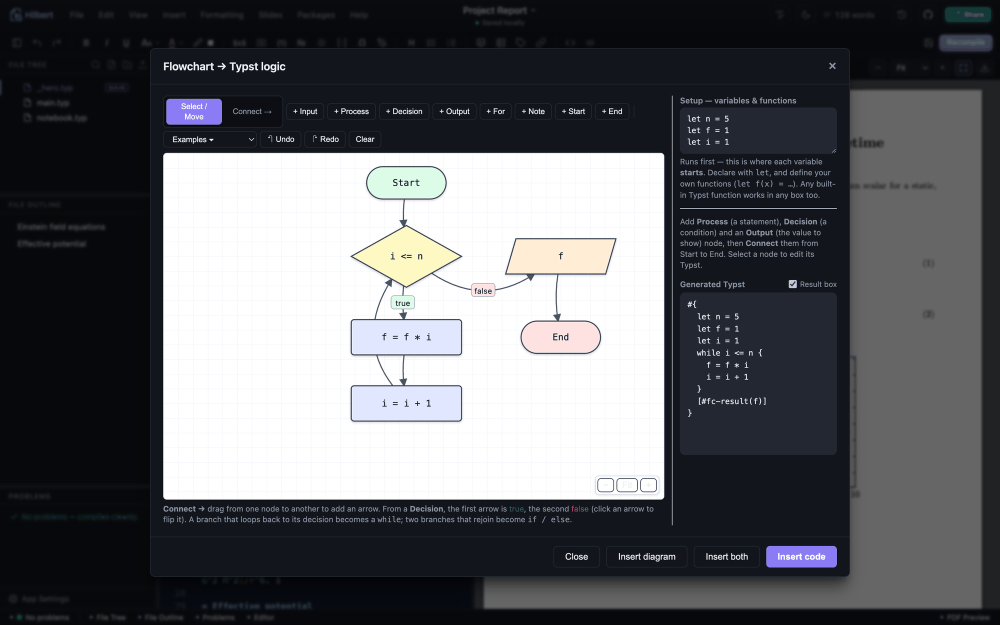
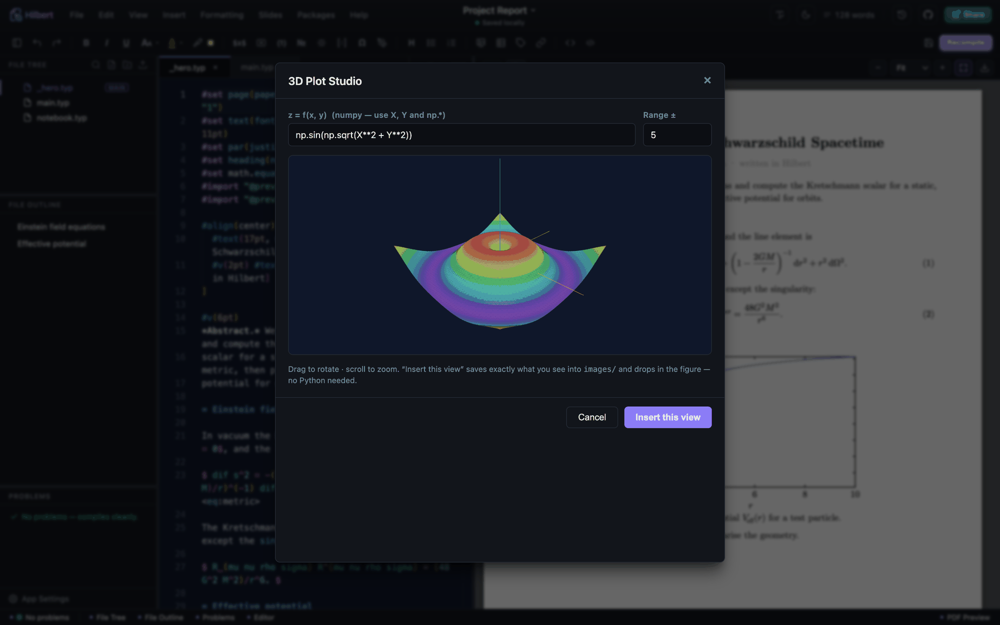
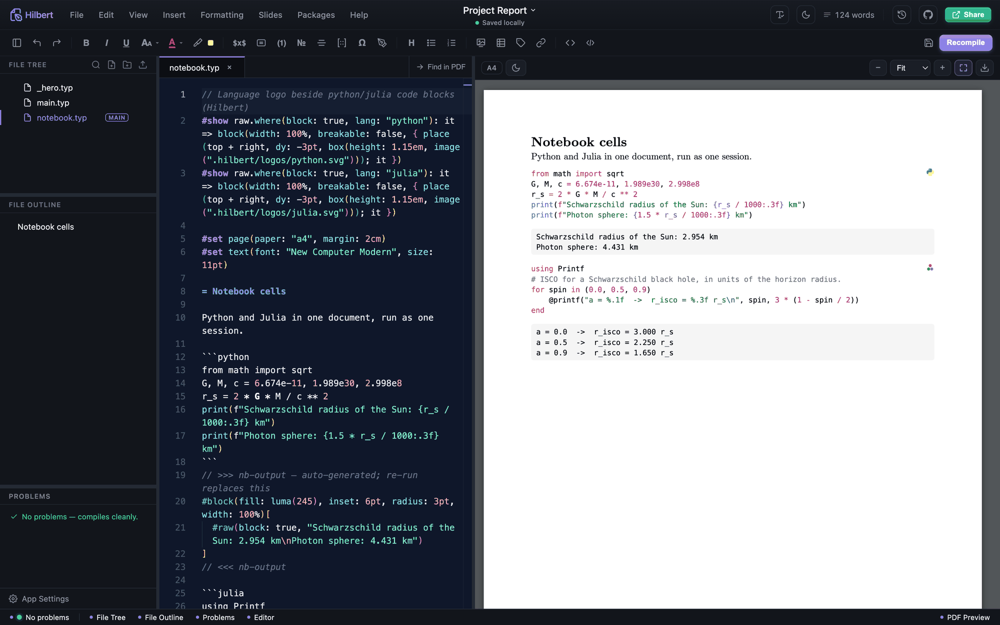
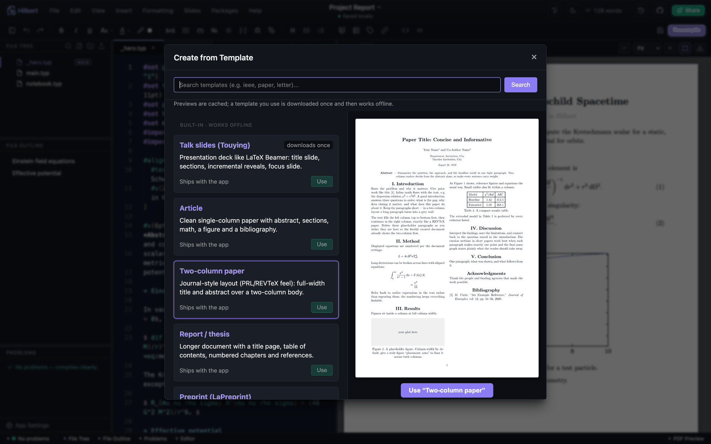

# Everything in the box

The full list of what Hilbert does, grouped by what you're doing. The
[README](../README.md) has the short version; this is the one that tries to
leave nothing out.

## Editing and preview

The Monaco editor handles Typst highlighting, and
[tinymist](https://github.com/Myriad-Dreamin/tinymist) supplies hover documentation
and autocomplete, plus live errors, warnings, information, and hints in Monaco and
the Problems panel. Hover any function for its signature and docs, and get completions
for every builtin, package export, and label. There's `@`-reference autocomplete, and
image-path autocomplete inside `image("…")`. Control-flow completions offer both the
`{ }` code body and the `[ ]` content body for `if`, `for`, and `while`. The same
engine drives code intelligence from the Edit menu and the editor's right-click menu:
go to definition, find references, rename a symbol across the file, quick fixes, and
whole-document formatting (F2) with the bundled typstyle formatter.

The PDF preview recompiles as you type, with zoom, fit-to-width, a dark PDF mode, and
double-click-to-source (it reads the surrounding words to land on the right
occurrence). When a compile fails you keep the last good preview and the errors move
to their own Problems tab, so a typo mid-sentence doesn't blank the page — the last
good render stays up from the moment you open a project, with a slim strip at the
bottom you click for the full error list. There's also an experimental **HTML Preview**
(View menu) that renders the document through Typst's HTML export.

Slide Studio builds editable 16:9 decks with templates, drag-and-drop positioning,
shapes, curves with optional arrowheads, equations, app-tool inserts, alignment controls, copy/paste,
undo/redo, optional grid snapping, and drag-reorderable slide thumbnails. Its layout
is stored inside ordinary Typst source, so an existing deck can be reopened and edited.

Multi-file projects compile from the project root (`main.typ`, or the `typst.toml`
entrypoint), so `#include`d chapters that share a bibliography or labels render as a
whole. The root file shows a MAIN badge; right-click any `.typ` and choose
**Set as main file** to change it.

Five interface themes, chosen from the sun/moon button in the header or in
**App Settings → Interface theme**, and they dress the whole window rather than the
editor pane alone: **Ink** (the default charcoal), **Paper**, **Sepia** for long
low-blue sessions, **Midnight** for a dark room or an OLED panel, and **High
Contrast**. The PDF preview keeps its own light/dark toggle, since paper is not
always what you want the page itself to be.

There's also a clickable Problems panel, a File Outline, resizable panes, a ⌘K command
palette covering every menu action, a Help window listing the features, and a live
word count of the rendered document (read from the PDF, so `#set` and `#import` lines
don't inflate it). The View menu and a status bar along the bottom switch the file
tree, outline, problems, editor, and preview on and off individually — hide the editor
to read, hide the preview to write. **File → New Window** opens another project in a
second window; it's one app (a single Dock icon) with independent windows, each with
its own preview, and comment/uncomment works on the current line or selection (⌘/ or
Ctrl+/, in Typst, Python, Julia, `.bib`, and more).

Proofreading is off until you switch it on, because the dictionaries are the largest
thing Hilbert ever loads. Switched on, it checks spelling with a Hunspell dictionary
and grammar and style with [Harper](https://github.com/Automattic/harper), which reads
the document as Typst and so leaves code, maths, and markup alone. Findings land in a
Proofread panel and as squiggles in the editor: click to jump, click a chip to apply a
fix. Identical complaints collapse into one row with a count, `All → …` fixes every
one of them in a single undo step, **Ignore** puts the whole group aside for the
session, and **+ Dictionary** keeps a word for good. Acronyms and code-style names
(`CMB`, `LaTeX`, `arXiv`) are never sent to the dictionary.

It follows the language the document declares. `#set text(lang: "fr")` is checked
against the French dictionary; **App Settings → Spelling** fetches any of ninety-eight
languages from the LibreOffice collection, each with its licence saved beside it, and
any Hunspell pair you drop into that folder yourself works too. Where no dictionary is
installed the panel says so rather than staying quiet. Grammar and style are English
only — the dialect follows the region, so `region: "GB"` gets British rules — and the
personal dictionary is kept per language.

**View → Label Graph** draws the document's cross-references: every `<label>` as a
point, every section as a bar, and an arrow from a section to each label its prose
refers to. Reading left to right is reading the document, so an arrow pointing left is a
reference backwards, which most of them are. Hover a label to see which sections lean on
it, click to keep that in view, double-click to open it in the editor. The side panel
lists the labels nothing refers to, references to labels that do not exist, and labels
defined more than once — three mistakes that a compiler either ignores or reports far
from where they were made.

## Projects and files (VS Code style)

**Open Folder** makes any folder on disk the workspace, with edits saved straight back
on the desktop app and in Chrome/Edge, plus **File → Open Recent**. The file tree does
multi-select, drag-and-drop moves, rename, duplicate, delete, cut, copy, paste, a
right-click menu, new file and folder, asset upload, compress to `.zip`, and
reveal-in-file-manager. Full-text search across the workspace jumps you to the line.
Files changed on disk by Git or another editor are picked up automatically; if you had
unsaved edits, Hilbert shows both versions side by side and lets you choose rather than
silently overwriting either one.

## Inserting the annoying stuff

Title blocks, headings, abstracts, authors, and institutes. Inline, block, aligned,
and numbered equations, with numbering on by default (toggle it under the cursor with
⌘⇧N). Matrices through the visual Matrix Studio, plus tables, figures, images, and
lists, most with a *center on page* toggle.



The Page Setup builder (Formatting → Page Setup) writes the `#set page(...)` rule for
paper size, per-side margins, header and footer, and page numbers. Text formatting
covers bold, italic, super- and subscript, a draggable colour picker, underline,
highlight, strike-through, boxed selections with fill and border and texture, a
font-size dropdown, alignment, rotation, small caps, and a full-width horizontal rule
(⌘⇧H).

Cross-references work by adding a label (`= Intro <sec:intro>`), typing `@`, and
picking it. The image editor crops and rotates PNGs and JPGs before inserting; SVGs
open as a safe preview.

## Maths and physics

A maths and physics symbol picker backed by `physica`, and a draw-a-symbol pad that
matches your sketch against the glyph shapes offline.



Theorems, proofs, and lemmas, plain or in coloured boxes, each kind numbered
separately. A Physics & Cosmology menu of ready-made, compile-checked equations:
bra-kets, commutators, the Dirac and Klein-Gordon equations, the QED Lagrangian,
Einstein's field equations, Christoffel symbols, the FRW metric, and the Friedmann
equations. An equation gallery of fill-in templates sits alongside it.

## Plots and diagrams

Plot Studio is the unified plotting tool: 2D functions (explicit, implicit,
parametric), 2D data (line, scatter, bar), 3D `cetz` surfaces, and launchers for the
interactive 3D studio and the Python/matplotlib runner.

cetz Canvas is a visual shape builder with 13 primitives (circle, ellipse, rectangle,
triangle, hexagon, line, arrow, arc, curve, grid, point, axes, label), a live preview,
and per-shape position, size, rotation, and colour. It can also plot a curve straight
from a data file once you pick the X and Y columns.



3D Plot Studio gives you a surface you rotate by hand, then insert exactly that view.
Commutative diagrams come from the bundled offline copy of
[quiver](https://github.com/varkor/quiver) as editable `fletcher`. Feynman diagrams are
drawn visually and come out as editable `cetz`. Flowchart to Code turns drawn logic
into `while`, `if`, and `for`. General 2D plotting runs through `cetz` and `cetz-plot`.







## Maths that computes

Run code and insert the result (Python, Julia, or Wolfram) as text output, a generated
figure, or, in *equation mode*, write plain maths like `diff(sin(x**2), x)` and get a
typeset equation back.

Run Notebook executes every ```` ```python ```` and ```` ```julia ```` block in the
document as one session, so variables persist between cells. Output and plots land
below each block, and the compiled PDF badges each block with its language logo.



Figures are saved as PNG by default; App Settings → Interpreters switches that to SVG
or PDF, so plots stay vector and print sharp. Asking for a format in the code wins over
the setting — Julia's `plot(x; fmt = :pdf)`, or naming the file yourself with
`savefig("figure.svg")`. EPS is there for journals that insist on it: Typst cannot embed
EPS, so those runs also write a PDF of each figure and the document points at that one.

Compute on a selection: highlight an expression and simplify, solve, differentiate,
integrate, or evaluate it with sympy, dropped back in as an equation.

The runner ships with physics examples: General Relativity with
[xAct](http://www.xact.es/) (Schwarzschild curvature through to the Ricci tensor and
the Kretschmann scalar), Penrose diagrams, and Clebsch-Gordan and Wigner 3-j
coefficients, as a rendered image or a typeset equation.

## References and bibliography

A reference and label manager lists every label and `@reference`, flagging the
undefined, duplicated, and unused ones. The citation manager looks a paper up by DOI
or arXiv id, saves it to `refs.bib`, and cites it with `@key`, adding the bibliography
section for you.

## Getting things in and out

Import data from CSV, TSV, or Excel with a preview, then insert it as a Typst table, a
plot with the columns you choose, or a variable. JSON, YAML, and TOML come in with the
matching Typst reader wired up. Import your own fonts (`.ttf` / `.otf`) via
File → Import Font.

Templates come from Typst Universe with a rendered preview, and six ship with the app
for offline use, including a two-column journal paper and a LaPreprint-style preprint
with margin notes, ORCID links and a running footer. Export goes to PDF (with page
ranges, PDF/A standards, tagging, and pretty-printing), PNG, SVG, HTML, plain `.typ`,
or the whole project folder, through your system's save dialog. Git support covers
init, commit, and push to GitHub. There's also sync to a local folder, Google Drive,
or WebDAV (Nextcloud and ownCloud), and a package manager to search, download, and
remove Typst packages.



Live collaboration is **experimental** — it works, but expect rough edges, so keep your
own backup of anything important. **Read [docs/COLLABORATION.md](docs/COLLABORATION.md)
before your first session**: it covers hosting, joining, rejoining, the network setups
(one router, campus, dedicated relay), and troubleshooting. It is offline-first and
account-free. From the command
palette, share the whole project (text, images, fonts and whiteboards) on the detected
campus/LAN address and pass on the generated invitation, or paste an invitation to join
and receive the project into a folder of your choosing. Hilbert starts a separate collaboration-only
listener (port 3020 when available); it never exposes the workspace API. Yjs updates,
presence, and cursors are encrypted end to end with the one-session key in the
invitation. A user-operated relay can be selected instead by setting its `ws://` or
`wss://` address. The standalone relay is:

```sh
hilbert --sync-server --port 3020
```

For an Overleaf-like browser workspace, the same binary can serve the built Hilbert UI,
one fixed server-side project, the compiler, and automatic live collaboration:

```sh
HILBERT_SERVER_TOKEN="a-random-secret-of-at-least-32-characters" \
  TYPST_DIST=/path/to/dist \
  hilbert --hosted-server --bind 127.0.0.1 --port 3001 \
  --workspace /srv/hilbert/project
```

Use `--bind 0.0.0.0` for network access. Encrypted browser collaboration requires HTTPS
(including on a LAN) or a localhost SSH tunnel; plain LAN HTTP can edit and compile but
browsers withhold the encryption API there. In this mode the server workspace is
authoritative, so browser visitors do not silently get an offline folder on their own
device. Code running is available to signed-in users, and a hosted server will not run
any unless the kernel can confine it — install `bubblewrap`, or set
`HILBERT_SANDBOX=off` to accept running it unconfined. See the hosted-workspace section in
[docs/COLLABORATION.md](docs/COLLABORATION.md) for the security and backup details.
Keeping the same server token and workspace path also keeps authenticated sessions and
the encrypted live room stable through an ordinary hosted-server restart.
Unsaved text is additionally kept in device-local browser recovery storage until the
server confirms it. After an outage Hilbert safely replays a draft whose base is still
current, or asks before replacing a server copy that changed separately. This protects
in-flight edits but does not replace normal server backups or create a full offline
project clone.
For a routed campus connection, keep the server on loopback and forward it with
`ssh -N -L 3001:127.0.0.1:3001 user@server`, then browse to
`http://127.0.0.1:3001`.

The host must remain online for a direct session. Everyone's ordinary project file
continues to save locally, and reconnection merges live CRDT updates while the session
is active. For step-by-step setup, including the single-router, campus, and dedicated
relay cases, see [docs/COLLABORATION.md](docs/COLLABORATION.md).

## Reliability and platform

The auto-updater (Tauri build) checks on launch and asks before installing. If the
check can't run, the app still starts normally.

Heavy tools (3D studio, Plot Studio, whiteboard, code runner) are isolated, so an
error in one shows a dismissible message instead of blanking the editor. A failed
compile keeps your last good preview. On Windows, background tools never flash a
console window. Closing a secondary window also stops its private local server and
preview watcher; language-server processes shared with another open window remain alive
until the last window using that project closes. Bundled Typst packages are cached
locally, so documents compile with no network and no downloads.

What you set is what you come back to. The interface theme, editor font size,
auto-compile delay, which panels are showing, the pane sizes, and the interpreter you
picked for each language are all kept in a file next to the session, so they survive
a restart, a reboot, and a second window. They used to live in the webview's storage,
which is tied to the port the app happens to get — and losing that port meant the
editor reopening at 14pt as though you had never told it otherwise.

The app keeps an activity log, and **Help → Copy Diagnostics** puts it on the
clipboard together with the Typst and tinymist it found and the `PATH` it searched.
Worth reaching for before filing a bug: on Windows especially, a windowed app has no
console to print to, so without it there is nothing to look at afterwards. The same
content is on disk — see [Configuration and security](CONFIGURATION.md) for where.
