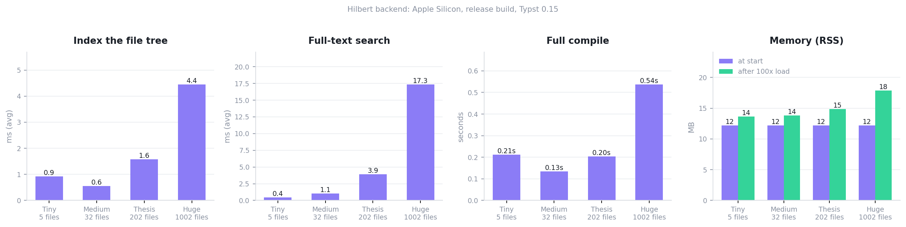

# Hilbert: performance report

Measured numbers for the shipping app: a Rust/axum backend
(`src-tauri/src/server.rs`) behind the system WebView, driving the Typst CLI.

Everything here is reproducible. `scripts/bench.mjs` generates the workspaces and runs
the backend against each one; `scripts/bench_plot.py` draws the chart from the JSON it
writes.

```bash
node scripts/bench.mjs        # writes bench-results.json
python scripts/bench_plot.py  # writes docs/performance.png
```

Test machine: Apple Silicon (arm64), macOS 15, release build, Typst 0.15.0. Averages
over 5 to 20 iterations per figure. Re-run before each release.

Section 3 was measured separately against a real paper rather than a generated one, on
an Apple M2 laptop and on a Xeon E3-1220 v5 server, both with Typst 0.15.1.

---

## 1. Backend

Four workspaces of increasing size. `main.typ` `#include`s every chapter, so a full
compile scales with the project.

| Workspace | chapters | bib refs | files |
|---|---:|---:|---:|
| Tiny   | 3    | 5    | 5 |
| Medium | 30   | 100  | 32 |
| Thesis | 200  | 500  | 202 |
| Huge   | 1000 | 2000 | 1002 |



| Metric | Tiny | Medium | Thesis | Huge |
|---|---:|---:|---:|---:|
| Index the file tree, avg (ms) | 0.9 | 0.6 | 1.6 | 4.4 |
| Full-text search, avg (ms)    | 0.4 | 1.1 | 3.9 | 17.3 |
| Full-text search, worst (ms)  | 0.6 | 1.9 | 5.7 | 18.4 |
| File-op cycle, avg (ms)¹      | 1.7 | 0.8 | 0.8 | 0.7 |
| Full compile, avg (ms)²       | 212 | 134 | 204 | 536 |
| RSS at start (MB)             | 12  | 12  | 12  | 12 |
| RSS after 100x load (MB)³     | 14  | 14  | 15  | 18 |

¹ create, rename, then delete: one HTTP round trip each.
² `main.typ` including every chapter, through the Typst CLI.
³ After 100 hammered tree and search requests, to surface leaks.

Reading the data. The backend starts at **12 MB** and stays there: a thousand-file
project costs about 6 MB more, and hammering it adds a few MB that get reclaimed.
Search is the only thing that scales visibly with project size, and even across 1000
files the worst case is 18 ms, comfortably inside a keystroke. File operations stay
under 2 ms at every size. Compile is dominated by the Typst CLI rather than by the
backend, which is why the Huge figure (0.54 s for 1000 chapters) sits close to what
`typst compile` costs on its own.

---

## 2. Startup, and the app as a whole

| Metric | Value |
|---|---|
| Backend process to first HTTP response | 32 ms warm, roughly 650 ms on a cold first run |
| App launch to embedded server ready | 231 ms |
| Page load to editor interactive | about 300 ms |
| Page load to a rendered 300-page PDF | about 1.5 s |
| Installed size (`Hilbert.app`) | 37 MB (16 MB binary, 18 MB UI, 2 MB Typst packages) |
| Frontend JS heap | about 31 MB |

A 300-page stress document (7000 lines, 300 tables, 100 code blocks, heavy maths)
compiles in about **1.0 s** and first-renders in about **1.5 s**. Twenty consecutive
compiles of it leave resident memory flat.

Live preview keeps one `typst watch` process per workspace and entry file, so warm
edits reuse Typst's compiler state instead of starting a new process. Switching
projects, changing the entry file, or importing fonts replaces the watcher cleanly.
The backend retains the one-shot compiler as a fallback if the watcher is unavailable,
and explicit exports still compile independently so export options remain isolated
from preview state.

---

## 3. A real paper

The generated workspaces above vary one thing at a time. This section is a single
document somebody actually wrote — a physics note with the mixture that goes with one:

| | |
|---|---|
| Lines / bytes | 1365 / 62 KB |
| Words | 11,395 |
| Numbered equations | 42 |
| Figures | 12 (PNG) |
| Sections in the outline | 47 |

Run on two machines, both release builds, both Typst 0.15.1:

| | laptop | server |
|---|---|---|
| | Apple M2, 8 cores, 8 GB | Xeon E3-1220 v5, 4 cores @ 3.0 GHz, 31 GB |
| | macOS 26.6.1 | Ubuntu 22.04 |

| Metric | laptop | server |
|---|---:|---:|
| Typst compile, warm | **0.26 s** | **0.66 s** |
| Typst compile, cold | 0.67 s | 0.93 s |
| Proofread, first call (dictionaries) | 0.4 s | 0.7 s |
| Proofread, whole paper, first pass | 0.74 s | 1.4 s |
| Proofread after one word is typed | **11 ms** | — |
| Proofread, text unchanged | **10 ms** | — |
| Issues found | 300 | 300 |
| Backend RSS after proofreading | 257 MB | 253 MB |

The four-year-old Xeon lands within a factor of two of the M2 on every figure and uses
the same memory, which is the useful thing to know: the work is single-threaded and
cache-friendly rather than something a bigger machine fixes. A server with more RAM
buys nothing here — 8 GB is enough, and the 250 MB is the dictionaries.

These are laptop-only, measured through the dev server with a debug backend, so they
are the pessimistic end of what the app does:

| Metric | Value |
|---|---|
| Editor usable | 1.5 s |
| First PDF page on screen | 2.7 s |
| Keystroke to a repainted preview | 2.5 s |
| Typing 200 characters | 444 ms, i.e. **2.2 ms per character** |

That debug-versus-release distinction is not pedantic. A debug build lints the same
paper in **7 s** against the release build's 0.8 s — a factor of ten — and measuring the
wrong one has already sent this project chasing an imaginary performance problem while
missing a real crash sitting in the release build's log. Benchmark what ships.

---

## 3a. Slide Studio, as the deck gets longer

`npm run bench:slides` starts its own Vite, mounts the studio on a synthetic deck of
ten elements per slide, grabs one of them and walks the pointer across sixty frames.
The figure to watch is Chrome's own task time per frame — script, style, layout and
paint together — since that is what a dropped frame is made of. A 16.7 ms budget is one
frame at 60 Hz.

| Slides | Before | After | Worst frame, before → after |
|---|---|---|---|
| 6 | 6.0 ms | 5.7 ms | 6.9 → 5.1 ms |
| 24 | 6.8 ms | 6.2 ms | 11.2 → 5.9 ms |
| 60 | 9.6 ms | 6.3 ms | 24.6 → 7.1 ms |
| 120 | 14.9 ms | 6.5 ms | 40.2 → 7.9 ms |

Dragging one element rewrote the whole rail of thumbnails, so the cost of moving a box
grew with the number of slides you had — at 120 slides a frame took 14.9 ms of the 16.7
available and the worst one took 40, which is three frames on the floor. Each rail row
is now memoised on its slide object, which only the edited slide replaces, so a drag
costs the same whatever the deck's length. The "after" column also carries the new
image previews, which are real pictures rather than hatched placeholders, so it is
paying for more on screen (4157 DOM nodes against 3387) and still comes out ahead.

One warning, learned here at some cost. React's `<Profiler>` reports the *opposite*
result at small deck sizes: by its `actualDuration` the memoised version looks slower
at 24 slides (4.84 ms against 3.86), because it measures only React's own render phase
and not the DOM reconciliation that dominates this workload. The script reports both so
the disagreement stays visible. Trust the engine's number.

---

## 4. The optimizations behind these numbers

**Dictionaries load on demand, cutting idle memory by 14x.** The spelling and grammar
dictionaries (spellbook and Harper) cost about 150 MB resident. They used to be
preloaded on a background thread at launch, but proofreading is off by default, so
most people carried that memory forever without ever using it. They now load the first
time `/lint` is called, which only happens once proofreading is switched on, and the
load runs in the background so the first sentence is still checked promptly. Idle RSS
fell from **173 MB to 12 MB**.

**Proofreading looks at what changed, not at the whole document.** A pass over the
paper above costs about 740 ms — 310 ms of it parsing the Typst markup, most of the
rest running Harper's rules — and it used to run in full every time typing stopped,
although almost nothing had changed between two of those. The document is now cut into
pieces at blank lines, each piece's answers are kept under a hash of the piece, and
only the pieces that changed are checked again. Editing one paragraph costs one
paragraph: **11 ms instead of 740 ms**, a factor of sixty-five.

A cut may only fall where a piece parses the same alone as it did in the document,
which means never inside a fenced raw block or a display formula. The first pass over
an unseen document still goes through in one piece, because parsing a document once is
much cheaper than parsing each of its 275 paragraphs; its answers are then filed under
the paragraphs they came from, which is what makes the second pass cheap. A test
asserts the two routes find the same issues, and on the real paper both find the same
300 — 243 spelling, 53 grammar, 4 style, at the same offsets.

**Harper's thesaurus rule is switched off.** `BoringWords` suggests livelier synonyms,
which is noise in technical prose, so its output was already being discarded — but
leaving the rule enabled still made Harper unpack the thesaurus, and in 2.8 that asks
zstd for a 128 MB decompression window against a 100 MB limit and unwraps the error.
The panic took the whole editor with it under the old abort-on-panic release profile.
Panics now unwind, and the rule that reaches for the thesaurus is off.

**Monaco is created once** and swaps models between tabs rather than being torn down
and rebuilt. Models are disposed on tab close, which fixed a leak where every
opened-then-closed file kept a full document in memory.

**The editor's options object is memoised.** `@monaco-editor/react` calls
`updateOptions()` whenever the options prop changes identity, and reconfiguring the
editor mid-search resets its find-match highlights, which showed up as flicker while
typing in the find box.

**The PDF preview re-rasterises pages in place.** Resizing or zooming used to replace
the whole page area, blanking the document for a frame. Each page now renders
off-screen and is swapped in when ready, and pages outside the viewport are skipped
with an IntersectionObserver.

**Compile output lives in a hidden `.hilbert/` folder** per workspace, next to the
scratch directory used for code execution. Plots produced by a notebook run are moved
out into a visible `assets/` folder, because the document embeds them and they have to
survive a cleanup.

**Code execution is capped by the kernel**, not only by a timer. File-size and CPU
limits are set on the child process and captured output is truncated at 8 MB, so a
runaway cell cannot fill the disk or exhaust memory.

---

## 5. Where the memory actually goes

| Process | RSS |
|---|---|
| Backend, idle | 12 MB |
| Backend, once proofreading is enabled | about 174 MB (dictionaries), 257 MB after checking a 62 KB paper |
| WebKit content process | about 200 MB |
| tinymist language server (child) | about 33 MB |

The WebView dominates, which is the expected shape for a Tauri app: the system WebKit
is shared rather than bundled, so the binary stays at 16 MB where an Electron build
ships a whole copy of Chromium. The earlier Electron edition of this app idled around
320 MB across five processes and unpacked to 711 MB on disk.

Switching proofreading on is now the largest single memory decision in the app, and it
belongs to the user.

---

## 6. Component lifecycle

| Component | Pattern |
|---|---|
| Monaco editor | one instance, models swapped per file |
| PDF preview | stays mounted, re-rasterises in place |
| File tree | collapse hides children, nodes reused |
| Tabs | contents kept in state, editor state preserved |
| Package index | cached on disk with a TTL |
| Plot Studio, 3D studio, whiteboard, builders | lazy-mounted, freed on close |

The heavy tools are loaded on demand and freed when closed. That costs roughly 100 ms
to reopen one and keeps the resting footprint near zero, which is the right trade for
tools opened a few times per session. If reopening ever starts to feel slow, the WebGL
and canvas tools are the ones to convert to init-once-then-hide.
