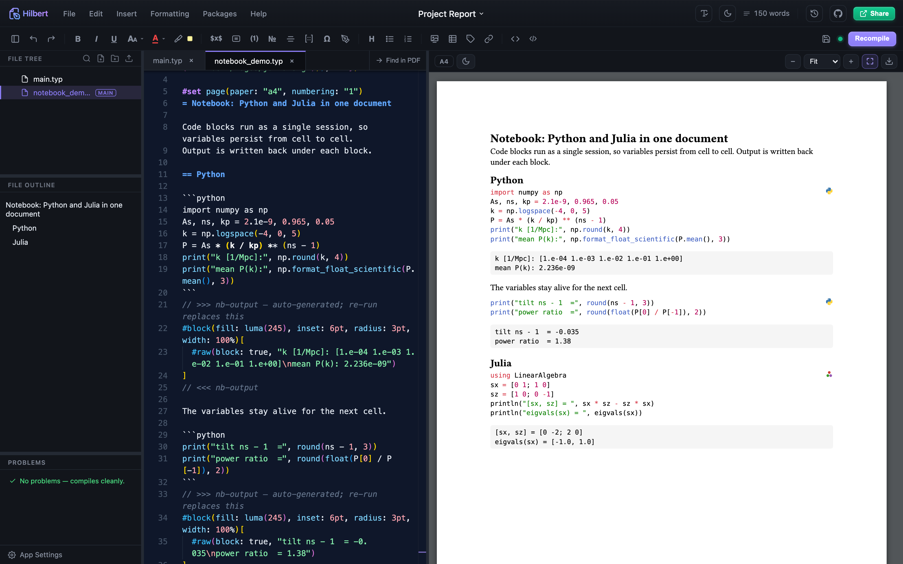

# Release notes

Paste the current section into the GitHub release when you cut a tag.

---

## 0.1.8

Mostly things people reported after 0.1.7.

### The cursor no longer jumps while you are typing

Starting to type could throw the cursor somewhere else in the file, so the
next few characters landed in the wrong place. Hilbert restores the cursor
position from your last session on startup, but it was waiting for the wrong
signal: the editor loads lazily, so the restore arrived too late and then fired
on the next change to the document — which is your first keystroke. It is
applied when the editor opens now, and typing cancels it outright. Coming back
to a tab also returns you to where you left off rather than to the top.

### Choose any Python or Julia, including one Hilbert didn't find

Settings → Interpreters now finds uv and pyenv environments, and the `.venv`
inside the project you have open — which is usually the one you actually want,
since it is the environment the code runs in. Anything else you can point at
yourself: browse to it or paste the path. Hilbert checks the file really is an
interpreter for that language before accepting it, labels it after the project
it belongs to, and remembers it.

Windows in particular got worse than it should have been: only `<env>\python.exe`
was checked, which is where conda puts it, while venv, virtualenv and uv put it
in `Scripts\`. That is why conda environments appeared there and project
`.venv`s did not. Both layouts are checked now. Windows also registers 0-byte
"app execution alias" stubs for python that open the Microsoft Store instead of
running anything; a real installation is preferred over one of those.

### Comment lines with Ctrl+/

⌘/ on macOS. This already existed through Monaco, but its shortcut is bound to
the physical US slash key, so it silently did nothing on AZERTY, QWERTZ and
other layouts where `/` needs a modifier. It now matches the character your
layout actually produces.

### Zoom the preview with the scroll wheel

Hold Ctrl (⌘ on macOS) and scroll over the page, or pinch on a trackpad, and
the preview zooms around the pointer. Alongside that, a bug that could leave
the page sitting off-centre next to a band of empty grey — with Fit unable to
put it back — is fixed. Each zoom level rebuilds the invisible text layer over
every page, and a slow rebuild for an old zoom level could finish last and
stretch the scrollable area. That also means double-clicking a word to jump to
its source is accurate again right after zooming.

### Hide the parts you are not using

A new View menu, and a status bar along the bottom, switch the file tree, file
outline, problems, editor and PDF preview on and off individually. Hide the
editor to read, hide the preview to write. The problem count in the corner
toggles the Problems panel the way an IDE does. Your layout is remembered, and
the editor and the preview cannot both be hidden.

Existing installs from 0.1.3 onwards pick this release up through the
auto-updater.

---

## 0.1.7

A feature release. The project also moved to a single repository — the frontend
and the Rust backend now live together, so building from source is one clone and
one `npm run dev` (see "Run from source" in the README).

### Slide Studio

A visual builder for 16:9 presentation slides. Drag, resize, and double-click-edit
text, equations, images, shapes, arrows, a translucent highlighter, and freehand
curves placed point by point (curves can now carry arrowheads at either end).
It comes with slide templates, undo/redo, copy/paste/duplicate, alignment helpers,
optional grid snapping, and a thumbnail rail you can reorder by dragging. The deck
is stored as ordinary Typst inside your document, so reopening the studio picks it
up for further editing — and while it's open, the equation galleries, Matrix
Studio, Feynman builder, plot tools and the rest drop their output onto the
current slide instead of into the text.

### Zotero citations

If the Zotero desktop app with the Better BibTeX plugin is running, Hilbert talks
to it locally: "Pick & cite" opens Zotero's own picker, and the chosen papers land
in `refs.bib` and are cited at the cursor in one go; "Import entire library"
merges your whole library without duplicates. Citation keys are sanitised to
Typst's legal character set (Better BibTeX can emit `$` inside a key when a title
contains maths, which breaks `@key` references), and keys already broken in
`refs.bib` heal themselves on the next import. If Zotero's main window is closed
— the app keeps running without one — Hilbert now reopens it automatically
instead of failing with a cryptic error.

### The preview recompiles several times faster while you type

The backend keeps one `typst watch` process per project, so a warm recompile
reuses the compiler's incremental state instead of paying process startup and a
full parse every time: roughly 120 ms instead of 500+ ms even for small
documents, and the default auto-compile delay dropped from 1 s to 0.1 s.
Switching projects, changing the main file, or importing fonts swaps the watcher
cleanly, a one-shot compile remains as the fallback, and quitting the app now
reliably shuts down the watcher and the language server instead of leaving them
running.

### Live errors from tinymist, before you compile

With tinymist installed, errors, warnings, and hints appear as squiggles in the
editor and in the Problems panel as you type. App Settings → General shows which
tinymist binary Hilbert found (bundled, environment, managed folder, or PATH),
its version, whether it's running, and a restart button.

### The local API now requires a per-launch token

The backend always listened on 127.0.0.1 only, with Host and Origin checks. On
top of that, every request now needs a random bearer token minted at launch and
handed only to the app's own window, so other local processes can't drive the
API. Scripted/headless use passes a `HILBERT_API_TOKEN` environment variable.

### Smaller things

- Wrapping a selection that cuts an emoji or a combining accent in half no
  longer produces invalid Typst — selections snap to character boundaries
  (the proofreader uses the same logic for its underlines).
- Edit Settings now edits your existing `#set text(...)` rule in place instead
  of stacking a new one on top, and accepts any font name and size.
- Problems panel entries say where they came from (Typst compiler vs tinymist).
- Code execution and compile endpoints are rate-bounded, and optional UI loads
  on first use, trimming startup work.

Existing installs from 0.1.3 onwards pick this release up through the
auto-updater.

---

## 0.1.6

A hotfix for three things people ran into with 0.1.5.

### Undo no longer resurrects the starter template

Reopening the app and pressing Ctrl+Z could replace your document with the
default starter text. The editor was quietly stacking your restored file on
top of the template it seeds new documents with. Fixed — undo now stops at
your own edits. Switching between projects also can't leak one document's
undo history into another anymore.

### The preview stopped flickering

Typing used to blank the preview to white on every recompile before the pages
came back. Pages now refresh in place: the old render stays on screen until
the new one is ready, so nothing flashes. The compile-error bar moved to the
bottom of the preview as well, so it no longer shoves the PDF down when an
error appears mid-edit.

### Export dialog, second pass

PDF version and conformance standard (PDF/A, PDF/UA) are now separate
choices instead of one mixed list. Exporting a project produces a single
`.zip` through the save dialog rather than copying loose files into a folder
— and the writer is built in, so it works the same on Windows. The redundant
"save straight to a folder" path is gone, the fields match the rest of the
UI, and the layout no longer jumps around when you switch formats.

---

## 0.1.5

### Python and Julia notebooks

Write code straight into the document and press Run Notebook. Every code block in the
file runs as one session, so variables carry from cell to cell. Output is written back
underneath each block, plots come back as figures, and the compiled PDF marks each
block with its language logo.

Saving no longer runs your code. A save typesets the document; only Run Notebook
executes anything.

### Finding things

⌘K opens a command palette covering every menu action, searchable by name.

Help → Features & Help opens a searchable list of what the app can do, where each
thing lives, and its shortcut.

### Export

The export dialog now offers PDF with page ranges, PDF/A archival standards, tagging
and pretty-printing, plus PNG, SVG, HTML, plain `.typ`, or the whole project folder.
It opens your system's save dialog instead of quietly writing to Downloads, remembers
your last format and folder, and can open the file when it is done.

### Editing

Feynman loops take fermion-flow arrows, clockwise or counter-clockwise.

The draw-a-symbol pad now recognises about 45 hand-drawn shapes and is no longer
marked experimental. Enter inserts the top match, 1 to 9 pick another, and Backspace
removes the last stroke.

Spelling and grammar checking (a basic checker: it catches misspellings and common
grammar slips, not subtle style problems). It is off by default; switch it on with the
tick icon in the header.

Data import reads CSV, TSV, and Excel, and will plot the columns you choose.

There is a two-column journal template, and ⌘⇧H inserts a full-width rule.

### Fixes

A failed compile no longer takes over the screen. The last good PDF stays up and the
errors move to their own tab.

The first load no longer shows a compile error before the backend has started.

Idle memory dropped from 173 MB to 12 MB. The spelling and grammar dictionaries cost
around 150 MB and were being preloaded at launch even though the checker is off by
default; they now load the first time you turn it on.

Exporting an SVG now shows the file in Finder rather than opening it, because the app
registered for `.svg` is often a source editor and would show you a wall of XML.

A GitHub personal access token is no longer written into `.git/config` when you push,
and it is stripped from any repository URL the app displays. A push that needs
credentials now fails quickly instead of hanging.

Requires Typst 0.15 or newer.
